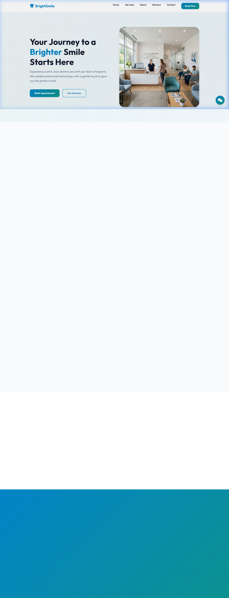

<div align="center">

# 🦷 BrightSmile — Dental Clinic Website

[](https://developer.mozilla.org/en-US/docs/Web/HTML)
[](https://developer.mozilla.org/en-US/docs/Web/CSS)
[](https://developer.mozilla.org/en-US/docs/Web/JavaScript)
[](https://ai.google.dev/)
[](https://opensource.org/licenses/MIT)

**A modern, responsive dental clinic website with AI-powered chatbot assistance.**

[Live Demo](#) · [Report Bug](https://github.com/alfredang/dentalclinic/issues) · [Request Feature](https://github.com/alfredang/dentalclinic/issues)

</div>

## Screenshot



## ✨ About

BrightSmile is a professional, fully responsive dental clinic website designed with a clean healthcare aesthetic. It features smooth animations, an interactive appointment booking system, and an **AI-powered chatbot** driven by Google's Gemini 2.0 Flash model to provide instant patient assistance.

### Key Features

| Feature | Description |
|---------|-------------|
| 🎨 **Modern Design** | Clean UI with soft blues/greens, glassmorphism effects, and smooth animations |
| 📱 **Fully Responsive** | Optimized for desktop, tablet, and mobile with CSS Grid & Flexbox |
| 📅 **Appointment Booking** | Frontend booking form with real-time validation and success feedback |
| 🤖 **AI Chatbot** | Gemini 2.0 Flash powered assistant for instant dental queries |
| 🦷 **Service Showcase** | Interactive service cards with hover effects and custom icons |
| ⭐ **Testimonials** | Patient review section with professional card layout |
| 🔗 **Smooth Navigation** | Sticky header, hamburger menu, scroll-reveal animations |

## 🛠️ Tech Stack

| Category | Technology |
|----------|-----------|
| **Structure** | HTML5 (Semantic) |
| **Styling** | Vanilla CSS3 (Flexbox, Grid, Custom Properties) |
| **Interactivity** | JavaScript (ES6+) |
| **AI Chatbot** | Google Gemini 2.0 Flash API |
| **Icons** | Font Awesome 6 |
| **Typography** | Google Fonts (Outfit) |

## 🏗️ Architecture

```
┌─────────────────────────────────────────────┐
│                  Browser                     │
├──────────┬──────────┬───────────────────────┤
│  HTML5   │  CSS3    │     JavaScript        │
│  Layout  │  Styles  │  (Form + Chat Logic)  │
├──────────┴──────────┴───────────────────────┤
│              Gemini 2.0 Flash API            │
│         (AI-Powered Chatbot Responses)       │
└─────────────────────────────────────────────┘
```

## 📂 Project Structure

```
dentalclinic/
├── index.html          # Main HTML structure
├── styles.css          # Complete stylesheet
├── script.js           # Interactive logic (menu, form, chatbot)
├── config.example.js   # API key config template
├── config.js           # Your local API config (gitignored)
├── .env                # Environment variables (gitignored)
├── .gitignore          # Git exclusions
├── screenshot.png      # App screenshot
└── assets/
    ├── hero.png        # Hero section image
    ├── cleaning.png    # Service icon
    ├── whitening.png   # Service icon
    ├── braces.png      # Service icon
    └── implants.png    # Service icon
```

## 🚀 Getting Started

### Prerequisites

- A modern web browser (Chrome, Firefox, Edge, Safari)
- A [Google Gemini API key](https://ai.google.dev/) (free tier available) for the AI chatbot

### Installation

1. **Clone the repository**
   ```bash
   git clone https://github.com/alfredang/dentalclinic.git
   cd dentalclinic
   ```

2. **Configure the API key**
   ```bash
   cp config.example.js config.js
   ```
   Open `config.js` and replace `YOUR_GEMINI_API_KEY_HERE` with your actual Gemini API key.

3. **Run locally**
   ```bash
   npx serve .
   ```
   Then open [http://localhost:3000](http://localhost:3000) in your browser.

## 🤖 Chatbot Setup

The AI chatbot uses Google's **Gemini 2.0 Flash** model. It acts as a friendly dental assistant that can answer questions about:

- 🕐 Clinic opening hours
- 🦷 Available dental services
- 📅 Appointment booking help
- 💰 Pricing inquiries
- 💬 General dental care advice

To enable it, ensure your `config.js` has a valid API key:
```javascript
const CONFIG = {
    GEMINI_API_KEY: 'your-api-key-here',
    GEMINI_MODEL: 'gemini-2.0-flash'
};
```

## 🤝 Contributing

Contributions are welcome! Here's how:

1. Fork the repository
2. Create your feature branch (`git checkout -b feature/amazing-feature`)
3. Commit your changes (`git commit -m 'feat: add amazing feature'`)
4. Push to the branch (`git push origin feature/amazing-feature`)
5. Open a Pull Request

## 👨‍💻 Developed By

**Alfred Ang** — [GitHub](https://github.com/alfredang)

## 🙏 Acknowledgements

- [Google Gemini AI](https://ai.google.dev/) — AI chatbot engine
- [Font Awesome](https://fontawesome.com/) — Icon library
- [Google Fonts](https://fonts.google.com/) — Outfit typeface
- Built with ❤️ using vanilla HTML, CSS, and JavaScript

---

<div align="center">

⭐ **Star this repo if you found it useful!** ⭐

</div>
